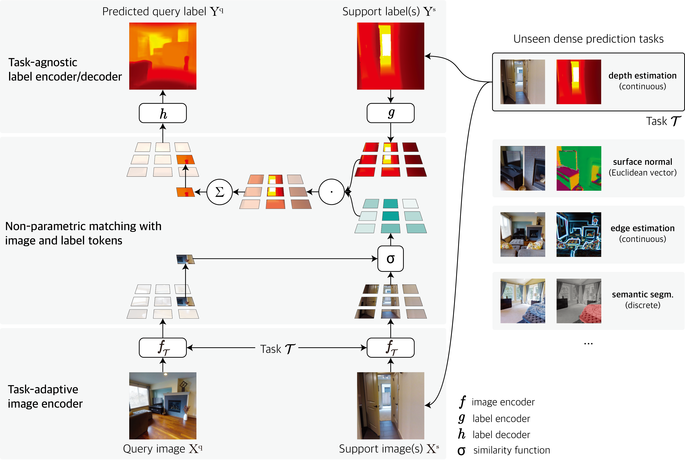

# Visual Token Matching

(News) Our paper recieved the [Outstanding Paper Award](https://blog.iclr.cc/2023/03/21/announcing-the-iclr-2023-outstanding-paper-award-recipients/) in ICLR 2023!

This repository contains official code for [Universal Few-shot Learning of Dense Prediction Tasks with Visual Token Matching](https://openreview.net/forum?id=88nT0j5jAn) (ICLR 2023 oral).



## Setup
1. Download Taskonomy Dataset (tiny split) from the official github page https://github.com/StanfordVL/taskonomy/tree/master/data.
  * You may download data of `depth_euclidean`, `depth_zbuffer`, `keypoints2d`, `keypoints3d`, `normal`, `principal_curvature`, `reshading`, `segment_semantic`, and `rgb`.
  * (Optional) Resize the images and labels into (256, 256) resolution.
  * To reduce the I/O bottleneck of dataloader, we stored data from all buildings in a single directory. The directory structure looks like:
  ```
  <root>
  |--<task1>
  |   |--<building1>_<file_name1>
  |   | ...
  |   |--<building2>_<file_name1>
  |   |...
  |
  |--<task2>
  |   |--<building1>_<file_name1>
  |   | ...
  |   |--<building2>_<file_name1>
  |   |...
  |
  |...
  ```

2. Create `data_paths.yaml` file and write the root directory path (`<root>` in the above structure) by `taskonomy: PATH_TO_YOUR_TASKONOMY`.

3. Install pre-requirements by `pip install -r requirements.txt`.

4. Create `model/pretrained_checkpoints` directory and download [BEiT pre-trained checkpoints](https://github.com/microsoft/unilm/tree/master/beit) to the directory.
  * We used `beit_base_patch16_224_pt22k` checkpoint for our experiment.

## Usage

### Training
```
python main.py --stage 0 --task_fold [0/1/2/3/4]
```

### Fine-tuning

```
python main.py --stage 1 --task [segment_semantic/normal/depth_euclidean/depth_zbuffer/edge_texture/edge_occlusion/keypoints2d/keypoints3d/reshading/principal_curvature]
```

### Evaluation

```
python main.py --stage 2 --task [segment_semantic/normal/depth_euclidean/depth_zbuffer/edge_texture/edge_occlusion/keypoints2d/keypoints3d/reshading/principal_curvature]
```
After the evaluation, you can print the test results by running `python print_results.py`

## Citation
If you find this work useful, please consider citing:
```bib
@inproceedings{kim2023universal,
  title={Universal Few-shot Learning of Dense Prediction Tasks with Visual Token Matching},
  author={Donggyun Kim and Jinwoo Kim and Seongwoong Cho and Chong Luo and Seunghoon Hong},
  booktitle={International Conference on Learning Representations},
  year={2023},
  url={https://openreview.net/forum?id=88nT0j5jAn}
}
```
